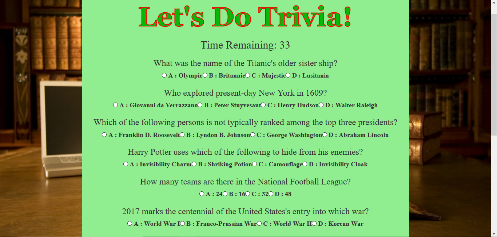
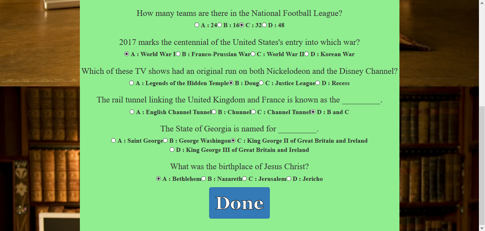

# Trivia Game

An interactive game in which the user to tests their knowledge by providing answers to ten questions/problems.

## How to Use

Player starts the game via the GitHub Pages [link](https://wespres1990.github.io/TriviaGame/).

Upon opening the game, the main page displays the "Start" button. When that is clicked, the trivia questions are displayed and the timer begins the countdown from 45 seconds, during which time, the player must attempt to answer all ten questions.

If the player succeeds in answering every question within the 45-second window, he or she may click the "Done" button will be taken to the results page to see how they did, or will otherwise be taken to that page automatically if time runs out. Displayed on that page will be the number of correct and incorrect answers the player provided, as well as the number which the player did not answer at all.

The game restarts when the player refreshes the page, and he or she has the main page displayed with the "Start" button.

### Technologies Used

Languages - HTML5, CSS4, Bootstrap, JavaScript, jQuery

Text Editor - Visual Studio Code

## Preview

### Start the Game
- - - -

### Timer and First Questions
- - - -

### Last Questions and Done
- - - -

### Results
- - - -

## Contributing

Please feel free to branch off with tweaks and making a repo; open to suggestions for improvement!

## Future Development

* Allow the player to restart the game from the application itelf, not by having to refresh the page.
* Show the player which answers were incorrect (if any) and provide the correct answers.

## Authors

* **Wesley Hutchins** - [Github](https://github.com/WesPres1990)